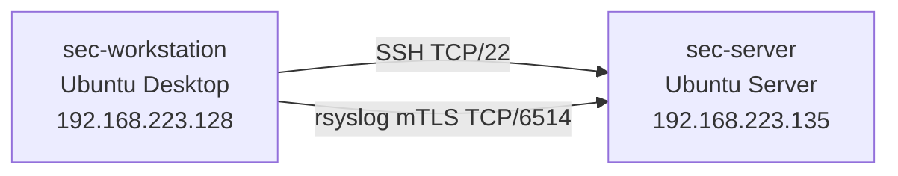

# Ubuntu Security Hardening Lab

A two-VM Ubuntu security hardening lab built in VMware Workstation. The project implements layered security controls for remote access, identity management, system auditing, centralized logging over mutual TLS, and automated security monitoring.

## Lab Environment

- **sec-server** — Ubuntu Server, `192.168.223.135`. The hardened target and centralized logging server. Runs auditd, UFW, Fail2Ban, PAM hardening, SSH hardening, AppArmor-confined rsyslog, and the automation scripts.
- **sec-workstation** — Ubuntu Desktop, `192.168.223.128`. The administrative workstation. Connects to `sec-server` over SSH and forwards its own logs to it over mutual TLS.

Both hosts run as VMware Workstation virtual machines on a private lab network.

## Security Controls

| Control | Technology | Implementation |
| --- | --- | --- |
| SSH hardening | OpenSSH, ED25519 key-based authentication | Key-only auth, root login disabled, `AllowUsers adminsec`, `MaxAuthTries 3` — [`configs/ssh/`](configs/ssh/) |
| Access control | Linux users and groups | Dedicated `adminsec` sudo/SSH account, unprivileged `auditor` account with group-based read access to audit reports, and locked legacy `ubuntu` account — [security-decisions.md](docs/security-decisions.md) |
| Firewall | UFW | Default-deny incoming, SSH allowed, TCP/6514 restricted to `sec-workstation`'s address — [`configs/ufw/`](configs/ufw/) |
| Password policy | PAM `pam_pwquality`, `pam_faillock` | 14-character minimum with complexity rules; `pam_faillock` configured for 5 failed attempts — [`configs/pam/`](configs/pam/) |
| Brute-force protection | Fail2Ban `sshd` jail | 5 attempts / 10-minute window, 10-minute ban — [`configs/fail2ban/`](configs/fail2ban/) |
| Application confinement | AppArmor | Packaged rsyslog profile in enforce mode, local overrides for the mTLS cert/key paths — [`configs/apparmor/`](configs/apparmor/) |
| Auditing | auditd | Rules on identity, sudo, SSH, rsyslog, and AppArmor configuration, plus privileged command execution; `-e 2` immutable mode — [`configs/auditd/`](configs/auditd/) |
| Centralized logging | rsyslog over GnuTLS mTLS | X.509 mutual authentication, `AuthMode x509/name`, CA-issued certificates — [`configs/rsyslog/`](configs/rsyslog/) |
| Automation | Bash, cron, logrotate | Monitoring, daily audit reports, daily backups, weekly cleanup, 30-day retention — [`scripts/`](scripts/) |

## Architecture



Full details on the controls inside `sec-server` are in [architecture.md](docs/architecture.md).

## Validation Highlights

- `adminsec` authenticated over SSH with its key; a connection attempt as `ubuntu` was denied — [success](evidence/ssh/adminsec-login-success.png), [denial](evidence/ssh/ubuntu-login-denied.png)
- A tagged log line sent from `sec-workstation` was received on `sec-server` over the mTLS channel — [sent](evidence/mtls/authorized-log-sent.png), [received](evidence/mtls/authorized-log-received.png)
- A connection without a client certificate was rejected by rsyslog — [screenshot](evidence/mtls/client-certificate-required.png)
- auditd attributed a command run through `sudo` to `adminsec`'s original login even though it executed as root — [screenshot](evidence/auditd/privileged-command-attribution.png)
- `pwquality` rejected a weak password during a `passwd` attempt — [screenshot](evidence/pam/weak-password-rejected.png)
- `aa-status` confirmed `rsyslogd` running in enforce mode — [screenshot](evidence/apparmor/rsyslog-enforcement.png)
- Scheduled audit reports and backups were generated on consecutive days — [screenshot](evidence/automation/generated-outputs.png)

Fail2Ban's IP banning, `pam_faillock`'s account lockout, backup restoration, and the 30-day retention cleanup are configured but were not functionally demonstrated — see [validation.md](docs/validation.md) for the full breakdown, including what each control actually covers.

## Repository Structure

```text
ubuntu-security-hardening-lab/
├── configs/
│   ├── apparmor/
│   ├── auditd/
│   ├── cron/
│   ├── fail2ban/
│   ├── logrotate/
│   ├── pam/
│   ├── rsyslog/
│   ├── ssh/
│   └── ufw/
├── docs/
├── evidence/
├── scripts/
├── LICENSE
└── README.md
```

## Documentation

- [Architecture](docs/architecture.md) — system design and how the controls fit together
- [Security Decisions](docs/security-decisions.md) — why each control was implemented this way
- [Validation](docs/validation.md) — what was checked against the running systems, and what wasn't

## Scope

This project was implemented and tested in a controlled VMware lab environment and is not a production deployment.
