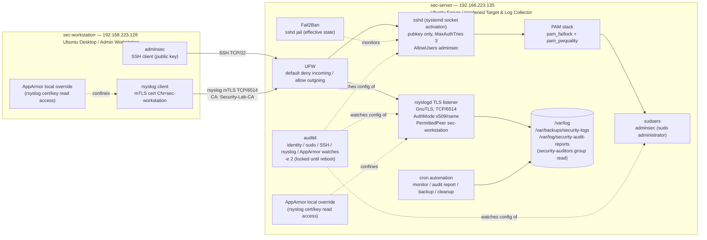

# Architecture — Ubuntu Security Hardening Lab

## 1. Overview

This document explains the architecture of the Ubuntu Security Hardening Lab, a VMware lab built to practice and document real Linux security hardening. It is not production infrastructure — it's a hands-on project covering SSH hardening, identity and access management, centralized logging over mutual TLS, auditing, and security automation, with configuration and verified system state tracked in this repository.

The lab consists of two virtual machines on a private VMware network:

| Host | Role | IP address |
|---|---|---|
| `sec-server` | Hardened target and centralized logging server | `192.168.223.135` |
| `sec-workstation` | Administrative workstation and remote log source | `192.168.223.128` |

The configuration in this repository is a mix of files that were authored directly and files that document verified state captured from the running systems (named `effective-*.txt`). When a section describes observed state rather than authored configuration, it says so directly — the two aren't always identical, as with the Fail2Ban `sshd` jail and part of the SSH policy.

## 2. Architecture Diagram



The diagram only shows what's actually in the lab. There's no router, cloud service, load balancer, or SIEM platform here — just the two hosts communicating directly over a private VMware network. Anything beyond that is outside the scope of this project.

## 3. Host Roles

### sec-server (192.168.223.135)
sec-server is the Ubuntu Server machine that gets hardened and also acts as the central log collector. It accepts SSH administrative connections, receives log traffic from sec-workstation over mutual TLS, and runs the security controls this project is built around: auditd, UFW, Fail2Ban, PAM hardening, SSH hardening, AppArmor confinement for rsyslog, and the cron jobs that handle monitoring, audit reporting, backups, and cleanup.

### sec-workstation (192.168.223.128)
sec-workstation is the Ubuntu Desktop machine used to administer sec-server. It connects over SSH as `adminsec` and forwards its own system logs to sec-server through the same mutual-TLS rsyslog channel.

## 4. Network and Trust Boundaries

The lab runs on a private VMware network with no routing to external networks. sec-server's firewall (UFW) is the main line of defense, backed up by controls at the service level:

- **SSH (TCP/22)** — reachable from any IPv4/IPv6 source per the effective UFW policy, but protected by public-key authentication, a restricted user list (`AllowUsers adminsec`), and a low `MaxAuthTries`.
- **rsyslog mTLS (TCP/6514)** — protected at two levels: UFW only allows traffic from `192.168.223.128`, and rsyslog itself requires mutual X.509 authentication (`AuthMode x509/name`) with an explicit `PermittedPeer`.

The logging channel is protected twice — by source IP at the firewall and by certificate identity at the transport layer. SSH relies mainly on authentication, since UFW doesn't restrict it by source address.

## 5. Administrative Access Architecture

SSH is the only way to remotely administer sec-server, and it's locked down accordingly (see [`configs/ssh/99-security-hardening.conf`](../configs/ssh/99-security-hardening.conf) and the verified [`configs/ssh/effective-ssh-policy.txt`](../configs/ssh/effective-ssh-policy.txt)):

- `PubkeyAuthentication yes`, `PasswordAuthentication no`, `KbdInteractiveAuthentication no`, `PermitEmptyPasswords no` — key-based authentication only.
- `PermitRootLogin no` — direct root SSH login is disabled.
- `MaxAuthTries 3` — limits authentication attempts per connection.
- `AllowUsers adminsec` — restricts SSH access to a single administrative account.
- On this version of Ubuntu, `sshd` runs through systemd socket activation instead of as a traditional standalone daemon.

### Identity model

| Account | Purpose | Notes |
|---|---|---|
| `adminsec` | Sole sudo administrator and authorized SSH user | Public-key SSH only |
| `auditor` | Read-only access to generated security audit reports | Non-sudo; access via membership in the `security-auditors` group, which owns `/var/log/security-audit-reports` |
| `ubuntu` | Legacy account retained for UID ownership and historical audit traceability | Password locked, SSH key disabled, no supplementary groups |
| `root` | — | Remote SSH login disabled (`PermitRootLogin no`) |

This setup separates administrative and auditing responsibilities. `adminsec` manages the server and has sudo access, `auditor` can read generated audit reports but nothing else, `ubuntu` is kept around only for file-ownership and traceability and can't log in at all, and root has no remote access.

## 6. Centralized Logging and mTLS Architecture

sec-server runs an rsyslog TLS listener on TCP/6514 using the GnuTLS stream driver ([`configs/rsyslog/10-tls-server.conf`](../configs/rsyslog/10-tls-server.conf)):

```
StreamDriver.Name    = gtls
StreamDriver.Mode    = 1                 # TLS
StreamDriver.AuthMode = x509/name
PermittedPeer         = sec-workstation
```

sec-workstation forwards its logs to sec-server with a matching client configuration ([`configs/rsyslog/90-forward-tls.conf`](../configs/rsyslog/90-forward-tls.conf)), targeting `192.168.223.135:6514/tcp` and authenticating with its own client certificate, permitting only sec-server as its peer. The forwarding action uses a named linked-list queue (`queue.type="linkedList"`, `queue.filename="tls_forward"`) configured to preserve queued messages on shutdown (`queue.saveOnShutdown="on"`).

Both sides authenticate each other with X.509 certificates issued by the lab certificate authority, `Security-Lab-CA`:

| Host | Subject CN | Role | SAN |
|---|---|---|---|
| `sec-server` | `sec-server` | TLS server (`server.crt`/`server.key`) | DNS `sec-server`, IP `192.168.223.135` |
| `sec-workstation` | `sec-workstation` | TLS client (`workstation.crt`/`workstation.key`) | DNS `sec-workstation`, IP `192.168.223.128` |

`AuthMode x509/name` combined with an explicit `PermittedPeer` on each side means both hosts check the other's certificate identity specifically, not just whether it was signed by the lab CA. Certificate and private key files are stored with `root:syslog 0640` permissions. Private keys and certificate contents are excluded from this repository — only certificate metadata (subject, issuer, SAN, key usage, and file permissions) is documented here.

AppArmor local overrides on both hosts extend the packaged rsyslog profile to allow read access to exactly the certificate and key paths rsyslog needs for this setup (see Section 9).

## 7. Audit and Tamper-Resistance Architecture

`auditd` on sec-server is configured with rule files under [`configs/auditd/`](../configs/auditd/):

- [`50-security-hardening.rules`](../configs/auditd/50-security-hardening.rules) watches:
  - Identity files: `/etc/passwd`, `/etc/group`, `/etc/shadow`, `/etc/gshadow` (key `identity_changes`)
  - Privilege configuration: `/etc/sudoers`, `/etc/sudoers.d/` (key `privilege_changes`)
  - SSH configuration: `/etc/ssh/sshd_config`, `/etc/ssh/sshd_config.d/` (key `ssh_config_changes`)
  - rsyslog/mTLS configuration: `/etc/rsyslog.conf`, `/etc/rsyslog.d/`, `/etc/rsyslog/ssl/` (key `logging_changes`)
  - AppArmor configuration: `/etc/apparmor.d/` (key `apparmor_changes`)
  - The audit subsystem's own configuration: `/etc/audit/` (key `audit_config_changes`)
  - Privileged command execution by authenticated users: an `execve` syscall rule scoped to `euid=0` and `auid>=1000` (excluding the unset-login-uid sentinel), keyed `privileged_commands`
- [`99-finalize.rules`](../configs/auditd/99-finalize.rules) sets `-e 2`, which locks the audit configuration so it cannot be altered again until the next reboot.

The verified state ([`configs/auditd/effective-audit-state.txt`](../configs/auditd/effective-audit-state.txt)), captured with `auditctl -s` on sec-server, confirms `enabled 2` — the immutability flag is active. This means once the rules are loaded, nobody (not even root) can modify or disable them without rebooting the system first, which is a much more disruptive and noticeable action. The effective-state file also notes a small kernel quirk: `auid!=4294967295` shows up as `auid!=-1` in the loaded rule — a good example of how what you write in a config file isn't always exactly what the kernel reports back.

The daily audit report script (Section 11) reads from this same rule set using `ausearch` and `aureport`, summarizing identity, privilege, SSH, logging, AppArmor, and audit-configuration changes, along with privileged command executions and authentication/login activity, for the previous 24 hours.

## 8. Authentication and Brute-Force Protection

Two PAM controls handle local authentication on sec-server, wired into the PAM stack as shown in [`configs/pam/pam-stack-relevant-lines.txt`](../configs/pam/pam-stack-relevant-lines.txt):

**Account lockout — `pam_faillock`** ([`configs/pam/faillock.conf`](../configs/pam/faillock.conf)):

| Setting | Value | Meaning |
|---|---|---|
| `deny` | 5 | Account locks after 5 consecutive failed authentication attempts |
| `fail_interval` | 900 | Failures are counted within a rolling 900-second (15-minute) window |
| `unlock_time` | 300 | The account unlocks automatically after 300 seconds (5 minutes) |
| `audit` | enabled | Faillock events are logged to the audit subsystem |

`pam_faillock` runs with `preauth` in `common-auth` (checked before the password itself), and again with `authfail` after a failed `pam_unix` attempt, with account-phase enforcement in `common-account`. This is the standard two-hook faillock setup.

**Password complexity — `pam_pwquality`** ([`configs/pam/pwquality.conf`](../configs/pam/pwquality.conf)):

| Setting | Value | Meaning |
|---|---|---|
| `minlen` | 14 | Minimum password length |
| `dcredit`, `ucredit`, `lcredit`, `ocredit` | -1 each | At least one digit, one uppercase, one lowercase, and one special character required |
| `minclass` | 3 | At least 3 of the 4 character classes must be present |
| `maxrepeat` | 3 | No more than 3 repeated characters in a row |
| `difok` | 4 | A new password must differ from the old one in at least 4 characters |
| `retry` | 3 | Up to 3 attempts to enter a compliant password |
| `enforce_for_root` | set | Complexity rules also apply when root changes its own password |

Together these cover two different problems: weak or predictable passwords (`pwquality`, enforced in `common-password` before `pam_unix`) and repeated login attempts against local accounts (`pam_faillock`, enforced in `common-auth` and `common-account`).

## 9. Application Confinement

AppArmor confinement here is narrow and specific: **local override files** extend the Ubuntu-packaged rsyslog profile to allow access to the TLS certificates and keys, rather than replacing it with a fully custom profile:

- [`configs/apparmor/sec-server-rsyslog.local`](../configs/apparmor/sec-server-rsyslog.local) grants read access to `/etc/rsyslog/ssl/ca.crt`, `/etc/rsyslog/ssl/server.crt`, and `/etc/rsyslog/ssl/server.key`.
- [`configs/apparmor/sec-workstation-rsyslog.local`](../configs/apparmor/sec-workstation-rsyslog.local) grants read access to `/etc/rsyslog/ssl/ca.crt`, `/etc/rsyslog/ssl/workstation.crt`, and `/etc/rsyslog/ssl/workstation.key`.

Each override adds only the file paths rsyslog needs for its role in the mTLS exchange (server or client certificate/key), on top of whatever the packaged profile already allows. It's a small, targeted extension of an existing profile — not a full AppArmor policy written from scratch.

## 10. Firewall Architecture

UFW is active on sec-server with the following effective policy ([`configs/ufw/effective-ufw-policy.txt`](../configs/ufw/effective-ufw-policy.txt)):

- Default incoming: **deny**
- Default outgoing: **allow**
- Default routed/forwarded: **deny**
- Logging: on (low)

| # | Rule | Port/proto | Action | Source |
|---|---|---|---|---|
| 1 | OpenSSH | 22/tcp | ALLOW IN | Anywhere (IPv4) |
| 2 | rsyslog mutual TLS | 6514/tcp | ALLOW IN | `192.168.223.128` (sec-workstation) |
| 3 | OpenSSH | 22/tcp | ALLOW IN | Anywhere (IPv6) |

SSH is reachable over both IPv4 and IPv6, with actual access control handled by the hardened OpenSSH policy (public-key auth, `AllowUsers`, `MaxAuthTries`). The mTLS logging port is restricted to a single IPv4 source address at the firewall, and **there's no IPv6 allow rule for TCP/6514** — IPv6 traffic to that port is blocked only because the default incoming policy is deny, not by an explicit rule written for it. This makes sense given the lab's IPv4-only rsyslog setup, but it does mean the firewall isn't fully dual-stack for the logging service (see Section 13).

## 11. Security Automation and Operational Flow

Security automation on sec-server runs from the root crontab ([`configs/cron/root-crontab`](../configs/cron/root-crontab)):

| Schedule | Script | Purpose |
|---|---|---|
| `*/5 * * * *` | [`monitor-system.sh`](../scripts/monitor-system.sh) | Checks disk usage (≥80%), memory usage (≥85%), and 1-minute load average (≥2.00); logs warnings via `logger -t security-monitor` and reports uptime and the top 5 processes by memory usage |
| `0 1 * * *` | [`generate-audit-report.sh`](../scripts/generate-audit-report.sh) | Builds a daily security audit report covering the previous 24 hours from `ausearch`/`aureport` output (authentication/login activity, and identity, privilege, SSH, logging, AppArmor, and audit-configuration change events); writes it to `/var/log/security-audit-reports`, owned `root:security-auditors`, mode `0640`; deletes reports older than 30 days |
| `0 2 * * *` | [`backup-security-logs.sh`](../scripts/backup-security-logs.sh) | Archives `/var/log/syslog`, `/var/log/auth.log`, `/var/log/fail2ban.log`, `/var/log/audit/audit.log`, and the audit report directory into a timestamped `tar.gz` under `/var/backups/security-logs` (dir `0700`, archive `0600`, both `root:root`) |
| `0 3 * * 0` | [`cleanup-backups.sh`](../scripts/cleanup-backups.sh) | Removes backup archives older than 30 days (`RETENTION_DAYS=30`) from `/var/backups/security-logs` |

Retention is enforced in two places: `generate-audit-report.sh` deletes reports older than 30 days, and `cleanup-backups.sh` does the same for backup archives. Each script's cron output goes to its own log file (`/var/log/security-monitor.log`, `/var/log/security-audit-cron.log`, `/var/log/security-backup.log`), and these are rotated weekly by logrotate ([`configs/logrotate/security-hardening`](../configs/logrotate/security-hardening)): 4 rotations kept, compressed with one cycle of delay, created with mode `0640` owned `root:adm`.

The overall flow: system monitoring every 5 minutes → daily audit report at 01:00 → daily log backup at 02:00 (scheduled after the report so it gets included) → weekly backup cleanup on Sunday at 03:00.

## 12. Repository Mapping

| Path | Contents |
|---|---|
| `configs/apparmor/` | rsyslog AppArmor local overrides for `sec-server` and `sec-workstation` |
| `configs/auditd/` | Authored audit rules, the `-e 2` finalization rule, and documented effective `auditctl -s` state |
| `configs/cron/` | Root crontab defining the automation schedule |
| `configs/fail2ban/` | Documented effective `sshd` jail state (no `jail.local` is authored in this lab) |
| `configs/logrotate/` | Rotation policy for the automation scripts' log files |
| `configs/pam/` | `faillock` and `pwquality` settings, plus the relevant PAM stack lines they hook into |
| `configs/rsyslog/` | TLS server/forwarder configuration and certificate metadata (no key material) for the mTLS logging channel |
| `configs/ssh/` | Authored SSH hardening drop-in and the documented effective `sshd -T` policy |
| `configs/ufw/` | Documented effective UFW firewall policy and verified listener state |
| `scripts/` | The four security automation scripts described in Section 11 |
| `evidence/` | Reserved for supporting evidence organized by control area (`auditd`, `automation`, `firewall`, `iam`, `mtls`, `pam`, `ssh`) |
| `docs/` | Documentation, including this architecture document |

## 13. Architecture Limitations

This lab documents one specific, working configuration — it's not meant to be complete or production-ready. Some known limitations:

- **IPv4/IPv6 asymmetry on the logging port.** SSH works over both IPv4 and IPv6, but TCP/6514 has no IPv6 allow rule and no IPv6 rsyslog configuration. IPv6 traffic to the logging service is blocked as a side effect of UFW's default-deny policy, not by a rule written specifically for it.
- **The Fail2Ban jail configuration wasn't written by hand.** The `sshd` jail values (`maxretry=5`, `findtime=600`, `bantime=600`) are what was observed running on sec-server; this repository doesn't include a custom `jail.local`.
- **AppArmor confinement is additive, not comprehensive.** The local override files add read access to specific certificate/key paths on top of the packaged profile — they don't add up to a fully custom AppArmor profile for rsyslog or any other service.
- **Audit rules can't be changed without a reboot.** The `-e 2` finalization rule is there on purpose, for tamper resistance, but it also means any legitimate change to the audit rules requires a reboot to take effect — a real cost that comes with the added security.
- **Single log collector, no redundancy.** sec-server is the only log destination. There's no secondary collector, no replication, and no off-host durability beyond the local backup archives it creates of itself.
- **No automated certificate rotation.** Certificates for the mTLS channel are issued and distributed manually; there's no automated renewal or rotation process documented here.
- **Auditor access is limited to generated reports.** The `auditor` account can read `/var/log/security-audit-reports` through the `security-auditors` group, but has no access to the raw `/var/log/audit/audit.log` or other system logs.
- **Lab scale and network.** This is two VMware VMs on a private lab network — it hasn't been tested at production scale, under real adversarial conditions, or with any internet-facing exposure, and no destructive or intrusive testing was performed.
